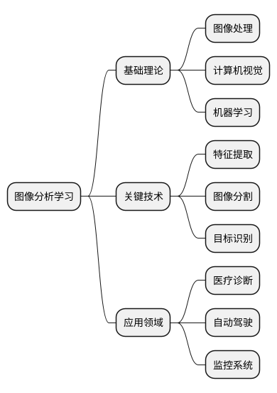
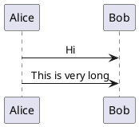

## 图像数字化
### 成像过程
![[Pasted image 20240108170435.png]]
## 成像变换
从计算机的角度出发，常用一个2-D的$M*N$的矩阵$F$来表示一幅2-D图像
[[齐次坐标透视变换]]
![[Pasted image 20240108190517.png]]
这张图片显示了一个三维点到二维点的透视变换过程，通过齐次坐标和变换矩阵的应用来完成。
左侧是一个4x4的透视变换矩阵 $P$，用于将三维坐标 $(X, Y, Z)$ 转换为齐次坐标 $c_h$。这个过程涉及到以下步骤：
1. **变换矩阵 $P$**：
   $$
   P = \begin{bmatrix}
   1 & 0 & 0 & 0 \\
   0 & 1 & 0 & 0 \\
   0 & 0 & 1 & 0 \\
   0 & 0 & -1/\lambda & 1
   \end{bmatrix}
  $$
   其中 $\lambda$ 表示透视投影中的一个参数，通常与摄像机视点到投影平面的距离有关。
2. **齐次坐标 $c_h$**：
   三维点的齐次坐标 $c_h$ 通过将变换矩阵 $P$ 与三维点的齐次坐标 $w_h = (kX, kY, kZ, k)$ 相乘得到，这里 $k$ 是一个比例因子：
   $$
   c_h = Pw_h = \begin{bmatrix}
   kX \\
   kY \\
   kZ \\
   -kZ/\lambda + k
   \end{bmatrix}
  $$
3. **透视投影的非齐次坐标 $c$**：
   非齐次坐标 $c$ 可以通过归一化齐次坐标 $c_h$ 得到，即最后一个坐标分量将用于对前三个坐标分量进行归一化：
   $$
   c = \begin{bmatrix}
   x \\
   y \\
   z
   \end{bmatrix} = \begin{bmatrix}
   \frac{kX}{-kZ/\lambda + k} \\
   \frac{kY}{-kZ/\lambda + k} \\
   \frac{kZ}{-kZ/\lambda + k}
   \end{bmatrix} = \begin{bmatrix}
   \frac{\lambda X}{\lambda - Z} \\
   \frac{\lambda Y}{\lambda - Z} \\
   \frac{\lambda Z}{\lambda - Z}
   \end{bmatrix}
  $$
最右边的部分指出这个变换如何从齐次坐标的形式变为传统的二维透视投影坐标。这通常涉及到除以齐次坐标的最后一个分量，也就是 $-kZ/\lambda + k$。这样得到的 $(x, y)$ 就是三维空间中点 $(X, Y, Z)$ 在二维平面上的透视投影坐标。
图中还提到了“投影坐标的非齐次化表示”，这是指从齐次坐标到非齐次坐标的转换，也就是常规的二维坐标系统。这是通过除以齐次坐标的最后一项 $w$ 来实现的，这样就可以得到二维平面上的点 $(x, y)$。这个过程是透视投影中的一个关键步骤，它允许我们将三维世界中的物体正确地表示在二维平面上，从而模拟人眼或相机的视觉效果。

![[Pasted image 20240108190710.png]]
这张图片描述了逆透视变换的过程，即如何从二维图像的齐次坐标 $c_h$ 反推回原始的三维世界坐标 $w_h$。
图中的公式 $w_h = P^{-1} c_h$ 显示了如何使用矩阵 $P^{-1}$ — 透视变换矩阵 $P$ 的逆矩阵 — 来实现这个逆变换。
逆矩阵 $P^{-1}$ 的形式是：
$$
P^{-1} = \begin{bmatrix}
1 & 0 & 0 & 0 \\
0 & 1 & 0 & 0 \\
0 & 0 & 1 & 0 \\
0 & 0 & 1/\lambda & 1
\end{bmatrix}
$$
其中 $\lambda$ 是透视变换中的参数。
这个逆变换的作用是将二维图像平面上的点映射回到三维空间。在实际操作中，这意味着我们可以根据二维图像中的点和一些额外的信息（如相机的内参、外参）来估计这个点在三维空间中的可能位置。通常，这个逆变换是不确定的，因为没有足够的信息来唯一确定三维空间中的一个点；不过，如果我们有足够的约束条件，比如多个不同视角的图像或者额外的深度信息，我们就可以通过逆透视变换来重建三维场景。
在计算机视觉和图像处理中，这种逆透视变换常用于从图像中提取三维信息，这对于立体视觉、3D重建、机器人导航等应用至关重要。

## 数字弦，紧致弦的判定方法
将每一个点都映射一个阴影区域，如果有两个点相连的线段超出了阴影区域，不为弦。