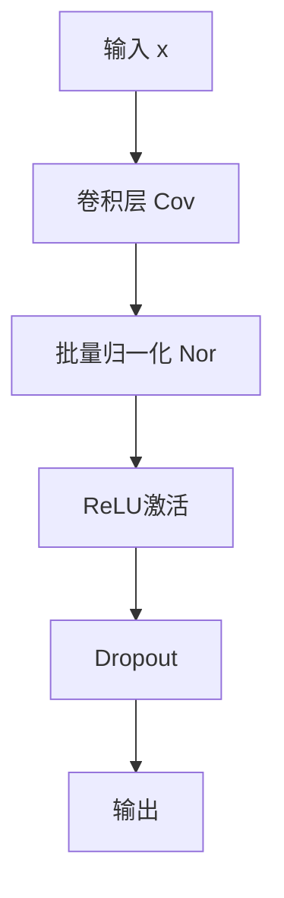

## model.py nor_cov类
```python
class nor_cov(nn.Module):
    # 定义一个名为nor_cov的类，继承自nn.Module，是PyTorch中的基础神经网络模块类。

    def __init__(self, in_channel, out_channel, dropout=False, normalize=False):
        # 类的初始化函数。接受输入通道数（in_channel），输出通道数（out_channel），
        # 是否使用dropout（默认为False），以及是否使用归一化（默认为False）作为参数。

        super(nor_cov, self).__init__()
        # 调用父类nn.Module的初始化方法。

        self.cov = nn.Conv2d(in_channel, out_channel, 3, 1, 1)
        # 创建一个2D卷积层，使用3x3的卷积核，步长为1，填充为1。

        self.normalize = normalize
        # 存储是否需要进行归一化的布尔值。

        if normalize:
            self.nor = nn.BatchNorm2d(out_channel)
            # 如果需要归一化，则创建一个批量归一化层，适用于输出通道数。

        self.relu = nn.ReLU()
        # 创建一个ReLU激活函数层。

        self.dropout = dropout
        # 存储是否需要应用dropout的布尔值。

        if dropout:
            self.drop = nn.Dropout(p=0.2)
            # 如果需要应用dropout，则创建一个dropout层，丢弃率设置为0.2。

    def forward(self, x):
        # 定义了模块的前向传播函数。

        x = self.cov(x)
        # 将输入数据x应用到卷积层。

        if self.normalize:
            x = self.nor(x)
            # 如果需要归一化，将卷积层的输出应用到批量归一化层。

        x = self.relu(x)
        # 应用ReLU激活函数。

        if self.dropout:
            x = self.drop(x)
            # 如果使用dropout，将激活函数的输出应用到dropout层。

        return x
        # 返回最终的输出。

```



## model.py CNN_Net代码解析
```python
class CNN_net(nn.Module):
    # 定义一个名为CNN_net的类，继承自nn.Module，是PyTorch中的基础神经网络模块类。
    def __init__(self, normalize=False):
        # 类的初始化函数，接受一个参数normalize来决定是否在网络中使用归一化。
        super(CNN_net, self).__init__()
        # 调用父类nn.Module的初始化方法。
        # 定义网络的不同层
        self.cov1 = nor_cov(in_channel=3, out_channel=64, dropout=True, normalize=normalize)
        # 定义第一个卷积模块，输入通道为3（对于RGB图像），输出通道为64，启用dropout和可选的归一化。
        # 接下来的几行是注释掉的其他可能的层定义，这里不进行解释。
        self.res2 = residual_block(64, dropout=True, normalize=normalize)
        # 定义一个残差块，输入和输出通道均为64，启用dropout和可选的归一化。
        self.pool1 = nn.MaxPool2d(2, 2)
        # 定义第一个最大池化层，使用2x2的窗口和步长2。
        # 以下是重复上述步骤，但逐渐增加卷积层的输出通道数和相应的残差块。
        self.cov2 = nor_cov(in_channel=64, out_channel=128, dropout=True, normalize=normalize)
        self.res4 = residual_block(128, dropout=True, normalize=normalize)
        self.pool2 = nn.MaxPool2d(2, 2)
        self.cov3 = nor_cov(in_channel=128, out_channel=256, dropout=True, normalize=normalize)
        self.res6 = residual_block(256, dropout=True, normalize=normalize)
        self.pool3 = nn.MaxPool2d(2, 2)
        self.cov4 = nor_cov(in_channel=256, out_channel=512, dropout=True, normalize=normalize)
        self.res8 = residual_block(512, dropout=True, normalize=normalize)
        self.pool4 = nn.MaxPool2d(2, 2)
        self.cov5 = nor_cov(in_channel=512, out_channel=256, dropout=True, normalize=normalize)
        self.res10 = residual_block(256, dropout=True, normalize=normalize)
        self.pool5 = nn.MaxPool2d(2, 2)
        self.cov6 = nor_cov(in_channel=256, out_channel=128, dropout=True, normalize=normalize)
        self.res12 = residual_block(128, dropout=True, normalize=normalize)
        self.pool6 = nn.MaxPool2d(2, 2)
        self.fc1 = nn.Linear(128 * 1 * 1, 200)
        # 定义一个全连接层，将前面层的输出转换为200个特征。
    def forward(self, x):
        # 定义模型的前向传播函数。
        # 下面的代码块是将输入x依次通过定义的各个层。
        x = self.cov1(x)
        x = self.res2(x)
        x = self.pool1(x)
        x = self.cov2(x)
        x = self.res4(x)
        x = self.pool2(x)
        x = self.cov3(x)
        x = self.res6(x)
        x = self.pool3(x)
        x = self.cov4(x)
        x = self.res8(x)
        x = self.pool4(x)
        x = self.cov5(x)
        x = self.res10(x)
        x = self.pool5(x)
        x = self.cov6(x)
        x = self.res12(x)
        x = self.pool6(x)
        x = x.reshape(x.shape[0], -1)
        # 将多维的特征图展平为一维，以供全连接层使用。
        x = self.fc1(x)
        # 将展平后的特征通过全连接层。
        return x
        # 返回最终的输出。
```
## 在最后几层（例如全连接层）才会有所谓的线性输出，那么其余的层是什么形式？
在卷积神经网络（CNN）中，除了最后的全连接层之外，网络的其它层（如卷积层、激活层、池化层）产生的输出通常是多维的，具体如下：
1. **卷积层（Convolutional Layer）**：
   - **输出形式**：卷积层的输出是一个多维数组，称为特征图（feature map）。
   - **维度**：每个特征图具有三个维度 - 高度（H）、宽度（W）和深度（D）。深度是由卷积层中过滤器的数量决定的，每个过滤器产生一个通道。
   - **特点**：每个通道通常捕捉输入数据的不同特征。
2. **激活层（Activation Layer，如ReLU）**：
   - **输出形式**：激活层通常对卷积层的输出应用非线性函数，输出形式仍然是多维特征图。
   - **维度**：维持与输入相同的维度（H x W x D）。
   - **特点**：非线性激活函数（如ReLU）通常在每个像素点上独立作用，不改变特征图的维度。
3. **池化层（Pooling Layer）**：
   - **输出形式**：池化层通过在特征图上进行下采样来减少其空间尺寸（高度和宽度），输出仍然是多维特征图。
   - **维度**：减少了高度和宽度，但深度（通道数）保持不变。
   - **特点**：例如，最大池化层会从其接收区域中选择最大值作为输出。
4. **归一化层（如Batch Normalization）**：
   - **输出形式**：归一化层对特征图进行规范化处理，输出也是多维特征图。
   - **维度**：与输入特征图的维度相同。
   - **特点**：归一化层通常用于改善训练的稳定性和速度。
5. **全连接层（Dense Layer）**：
   - **输出形式**：直到全连接层，前面层的多维特征图会被“展平”成一维向量。
   - **维度**：全连接层的输出通常是一维的，其长度由该层的神经元数量决定。
   - **特点**：全连接层用于将学习到的特征映射到最终的输出，如分类标签。
总的来说，在CNN中，除了最后的全连接层之外，大部分层产生的是多维特征图，这些特征图在网络中传递并逐渐变换，最终在全连接层中被转换为用于特定任务（如分类、回归等）的一维输出。


## 网络中的forward与在nor_cov和residual_block中定义的forward不是重复了吗
在深度学习框架中，如PyTorch，当你在自定义的每个模块（如`nor_cov`和`residual_block`）以及整个网络（如`CNN_net`）中定义`forward`方法时，并不是重复，而是层级和模块化设计的体现。每个模块的`forward`方法定义了该模块的特定前向传播逻辑，而整个网络的`forward`方法则定义了这些模块如何整合在一起。以下是具体的解释：
1. **模块级别的`forward`方法**：
   - 在诸如`nor_cov`或`residual_block`这样的自定义模块中，`forward`方法定义了该模块内部的具体操作，例如如何应用卷积、激活、归一化等。
   - 这意味着当你实例化并使用这个模块时，你只需要传入输入数据，模块内部的`forward`方法将负责完成所有定义好的操作。
2. **网络级别的`forward`方法**：
   - 在整个网络（如`CNN_net`类）的`forward`方法中，你定义了如何将不同的模块组合在一起以及数据如何在这些模块间流动。
   - 网络的`forward`方法可能会调用`nor_cov`、`residual_block`等模块的`forward`方法。在这个过程中，每个模块的`forward`方法都会按照其定义执行相应的操作。
3. **模块化和层级化**：
   - 这种设计使得代码变得模块化和层级化。每个模块负责自己的逻辑，而网络层级则负责如何整合这些模块。
   - 这样的设计让代码更加清晰、易于理解和维护，同时也提高了代码的复用性。
总之，模块级别和网络级别的`forward`方法并不是重复的，而是各自负责不同层级的逻辑。模块级别的`forward`负责单个模块内的操作，而网络级别的`forward`负责整个网络中多个模块的整合和数据流动。