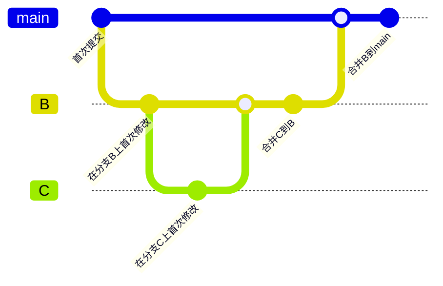

```dataview
table "["+file.name+"](http://"+url+")" as 网址,detail as 备注 from "8-InBox" where file.name != "网页收录"
```


```mermaid
gitGraph
	commit id:"首次提交"
	branch B
	checkout B
	commit id:"在分支B上首次修改"
	branch C
	checkout C
	commit id:"在分支C上首次修改"
	checkout B
	merge C
	commit id:"合并C到B"
	checkout main
	merge B
	commit id:"合并B到main"
```
