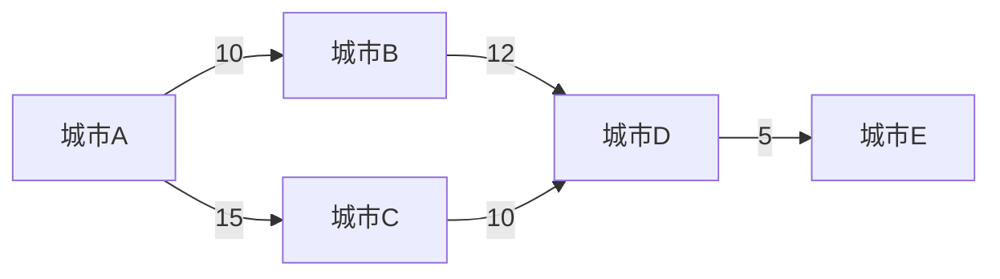

## 盲搜索是针对于搜索树还是搜索图的

"盲搜索"（Blind Search），也被称作无信息搜索（Uninformed Search），是指在没有额外信息（如启发式信息）帮助下对搜索空间进行探索的方法。这种搜索方式可以应用于搜索树（Search Tree）和搜索图（Search Graph）两种结构。

- **搜索树**：在搜索树中，盲搜索从根节点开始，按照一定的规则（如深度优先或广度优先）遍历树的节点。搜索树通常用于表示问题的决策过程，其中每个节点代表一个状态，而边代表从一个状态到另一个状态的转移。

- **搜索图**：搜索图是更一般的结构，它允许节点之间有更复杂的关系，比如回环（即一个节点可以通过不同路径多次到达）。在搜索图中进行盲搜索时，需要注意避免重复访问相同的状态，这通常通过维护一个已访问状态集合来实现。

总的来说，盲搜索是一种基本的搜索策略，适用于多种数据结构，包括搜索树和搜索图。这种搜索方式不依赖于特定问题的知识，因此具有普遍性，但可能效率不高，特别是在大型或复杂的搜索空间中。

## 启发式函数

启发式函数（Heuristic Function）是人工智能和计算机科学中的一个重要概念，尤其在解决搜索问题和优化问题时非常关键。它为搜索算法提供关于哪些路径最有可能导致目标的“提示”。在不同的上下文中，启发式函数的作用和定义略有不同，但核心思想是相似的：

1. **在搜索问题中**：启发式函数是一个估计函数，用于评估从当前状态到目标状态的最小成本（或步数）。这个估计基于问题特定的知识。例如，在解决路径寻找问题时，常用的启发式函数是估计从当前位置到目标位置的直线距离。

2. **在优化问题中**：启发式方法通常指的是一种找到良好（但不一定是最优）解的策略，这种策略通常基于问题的直观理解或经验法则。

启发式函数的关键特点是它们不保证总是找到最佳解决方案，但在实际应用中，它们通常能在合理的时间内找到足够好的解决方案。在复杂或计算量巨大的问题中，启发式搜索（比如A*算法）比传统的盲目搜索方法（如深度优先搜索或广度优先搜索）更有效率。

一个好的启发式函数应该满足以下条件：

- **启发性**：能够提供有用的信息，指导搜索朝着目标更有效地前进。
- **可计算性**：计算上不应过于复杂，以免消耗过多计算资源。
- **适当性**：适合于特定问题的特点和需求。

在实际应用中，设计有效的启发式函数是一项挑战，需要深入理解所处理问题的本质。

## 启发式搜索

启发式搜索是一种在搜索算法中使用启发式方法来指导搜索过程的技术。它旨在提高搜索的效率，特别是在大规模或复杂的搜索空间中。启发式搜索利用额外的信息（启发式信息）来估计哪些路径最可能导向目标或解决方案，从而优化搜索过程。这些信息通常基于对问题的特定知识或经验。

以下是一些关键概念和类型：

1. **启发式函数**：这是启发式搜索中的核心。启发式函数为每个状态提供一个估计值，这个值表示从当前状态到目标状态的预计成本或距离。这个估计值用于决定搜索的方向。

2. **$A*$搜索算法**：这是最著名的启发式搜索算法之一。它结合了最佳优先搜索和最短路径搜索的优点，通过一个评估函数（通常表示为 $f(n) = g(n) + h(n)$，其中 $g(n)$ 是从起始点到当前点的实际成本，$h(n)$ 是当前点到目标的启发式估计成本）来选择下一步的路径。

3. **局部和全局搜索**：启发式搜索可以是局部的，也可以是全局的。局部搜索算法（如爬山算法、模拟退火等）在搜索过程中只考虑当前状态的邻居，而全局搜索算法（如遗传算法）则考虑整个搜索空间。

4. **优点和缺点**：
   - **优点**：启发式搜索通常比盲目搜索方法（如深度优先或广度优先搜索）更有效率，因为它能够更有目的地导向解决方案，减少不必要的搜索。
   - **缺点**：选择或设计一个好的启发式函数可能很具挑战性，且不恰当的启发式函数可能导致搜索效率低下。此外，启发式搜索不总是保证找到最优解。

启发式搜索在多种领域得到应用，包括人工智能、计算机科学、运筹学和游戏理论等。正确应用时，它是解决复杂搜索问题的强大工具。

## 启发式函数的设计要求

启发式函数的设计对于启发式搜索算法的效果至关重要。一个好的启发式函数可以显著提高搜索效率，而一个不适当的启发式函数可能导致低效甚至失败的搜索。以下是设计启发式函数时应考虑的一些关键要求和原则：

1. **关联性（Relevance）**：启发式函数应当与问题的目标密切相关。它应该提供关于如何接近目标的有用信息。例如，在路径规划问题中，启发式函数常用两点间的直线距离作为估计，因为这与实际路径长度紧密相关。

2. **效率（Efficiency）**：计算启发式函数的成本应当是可接受的。如果计算启发式函数本身非常复杂和耗时，那么它可能会抵消启发式搜索带来的效率优势。

3. **保守性（Conservatism）**：对于最优性搜索（如A*搜索算法），启发式函数应该是乐观的，意味着它不应该高估到达目标的实际成本。一个保守的、乐观的启发式估计可以确保算法找到最优解。

4. **可调性（Adaptability）**：在不同的问题或问题实例中，启发式函数可能需要不同的形式或参数。设计时应考虑其适应性，使其可以根据问题的特定特征进行调整。

5. **简洁性（Simplicity）**：虽然复杂的启发式函数可能提供更精确的估计，但简洁性也很重要。一个简单但有效的启发式通常比一个复杂、计算量大的启发式更受欢迎。

6. **完备性和正确性（Completeness and Correctness）**：在某些情况下，启发式函数需要保证搜索的完备性（即总是能找到解决方案，如果存在的话）和正确性（即找到的解决方案符合问题要求）。

在实际应用中，启发式函数的设计往往需要在这些要求之间寻找平衡。此外，实验和调试也是设计过程的重要部分，可以帮助评估和完善启发式函数的性能。

## 可采纳性

"可采纳性"（Admissibility）在启发式搜索领域，特别是在关于A*算法和其他启发式搜索算法的讨论中，是一个重要的概念。一个启发式函数被认为是可采纳的（admissible），如果它永远不会过估计到达目标的实际最小成本。简单来说，可采纳性意味着启发式估计是乐观的，它保证了算法能够找到最优解。

以下是可采纳性的一些关键点：

1. **保证最优解**：如果一个启发式函数是可采纳的，那么使用这个函数的启发式搜索算法（如A*算法）将保证找到最优解，前提是解决方案存在。

2. **乐观估计**：可采纳的启发式函数提供一个成本估计，这个估计等于或小于从当前状态到目标状态的实际最小成本。这意味着启发式函数不会让算法“过于悲观”地放弃潜在的最优路径。

3. **与完备性的关系**：可采纳性通常与搜索算法的完备性（能够找到解决方案，如果存在的话）相关联。一个可采纳的启发式函数结合一个完备的搜索算法可以确保找到最优解决方案。

4. **设计挑战**：设计一个既可采纳又实用的启发式函数可能很有挑战性。过于乐观的估计可能导致搜索效率低下，因为它可能使搜索算法探索许多不必要的路径。另一方面，过于保守的估计可能导致错过最优路径。

在实际应用中，设计可采纳的启发式函数需要对问题有深入的理解，以及对如何平衡估计的准确性和计算成本的考虑。例如，在路径规划问题中，使用直线距离作为启发式函数通常是可采纳的，因为直线距离不会超过实际的路径长度。

## 哪些算法具有可采纳性

可采纳性是评价启发式函数，而非算法本身的特性。在谈论启发式搜索算法时，我们通常关注的是算法使用的启发式函数是否具有可采纳性。如果一个算法使用的启发式函数是可采纳的，那么这个算法在特定条件下能够保证找到最优解。

以下是一些常见的启发式搜索算法，它们可以具有可采纳性，但这取决于所使用的启发式函数：

1. **A*算法**：这是最著名的启发式搜索算法之一。A*算法本身是一个框架，它的可采纳性取决于所使用的启发式函数。如果启发式函数是可采纳的（即不会过估计实际成本），那么A*算法能够找到最优解。

2. **IDA*算法（Iterative Deepening A*）**：这是A*算法的一种变体，结合了深度优先搜索的空间效率和A*的最优性。和A*算法一样，IDA*的可采纳性也依赖于所用启发式函数的可采纳性。

3. **Dijkstra算法**：虽然通常不被视为启发式搜索算法，但Dijkstra算法可以看作是A*算法的一个特例，其中启发式函数始终返回0。这意味着它是可采纳的，因为它不会过估计实际成本。

4. **贪婪最佳优先搜索**：这种算法使用启发式函数来决定搜索的方向，但不保证找到最优解。如果所用的启发式函数是可采纳的，它可能在特定情况下找到最优解，但这通常不是保证的。

请注意，一个算法是否能找到最优解不仅取决于其使用的启发式函数是否可采纳，还可能取决于其他因素，如算法的具体实现细节。因此，在实际应用中，重要的是要了解所使用的启发式函数和算法的性质，以确保它们符合问题的需求和目标。

## 一致性

在启发式搜索领域，一致性（Consistency）或称为单调性（Monotonicity），是评价启发式函数的另一个重要属性。一个启发式函数被认为是一致的，如果它满足以下条件：

1. 对于任何节点 $n$ 和它的任何子节点 $n'$，通过从 $n$ 到 $n'$ 的边到达的成本加上 $n$ 的启发式估计值不大于 $n'$ 的启发式估计值。
   
   数学上表示为：$h(n) \leq c(n, n') + h(n')$，其中 $c(n, n')$ 是从节点 $n$ 到 $n'$ 的实际步骤成本。

2. 对于目标节点，启发式估计值应该是0。

一致性保证了在从起点到目标点的路径上，启发式估计是单调递增的。这个特性对于某些搜索算法，特别是A*算法，是非常重要的，因为它保证了算法不仅会找到最优解，而且会在找到解之前不会重复检查已经关闭的节点。

一致性的优点：

- **路径优化**：一致的启发式函数可以帮助优化路径的搜索过程，减少不必要的探索。
- **算法效率**：在A*算法中，如果启发式函数是一致的，那么算法会更加高效，因为它不需要重新打开已经关闭的节点。

值得注意的是，一致性是可采纳性（Admissibility）的一个更强的条件。换句话说，所有一致的启发式函数都是可采纳的，但并非所有可采纳的启发式函数都是一致的。一致的启发式函数不仅不会过估计到达目标的成本，而且还能保持对整个搜索过程中各个节点的一致估计。

## 什么是边到达的成本，可以使用mermaid图像解释

在启发式搜索和图算法中，"边到达的成本"（通常简称为“边的成本”或“步骤成本”）指的是从一个节点到另一个节点经过一条边的代价。这个成本可以是距离、时间、金钱或任何其他衡量资源的量度。在图表示中，节点代表状态或位置，边代表从一个状态转移到另一个状态的动作，而边的成本就是执行这个动作所需的代价。

我将使用一个简化的例子和Mermaid图来解释这个概念。假设我们有一个由节点组成的图，每个节点代表一个城市，边代表城市之间的道路，边上的数字代表从一个城市到另一个城市的距离。我们的目标是找到从一个起始城市到目的城市的最短路径。

下面是一个示意图：

在这个简化的例子中：
- 从城市A到城市B的路径成本是10。
- 从城市A到城市C的路径成本是15。
- 从城市B到城市D的路径成本是12。
- 从城市C到城市D的路径成本是10。
- 从城市D到城市E的路径成本是5。

这个图表展示了从每个城市到其他城市的直接路径成本。在实际应用启发式搜索算法时，这些成本会与启发式估计值结合，以帮助确定最有效的路径。

## 请你用这个例子说明一致性

当然，我将使用您提供的城市间的图来说明一致性的概念。在这个例子中，我们将考虑如何使用启发式函数来评估从各个城市到目的地城市E的成本，并检验这些估计值是否满足一致性的条件。

假设我们有一个启发式函数 $h(n)$，它为从任意城市 $n$ 到目的地城市E的成本提供估计。为了说明一致性，我们需要验证对于图中的任何两个相邻城市 $n$ 和 $n'$，以下条件都被满足：

$$h(n) \leq c(n, n') + h(n')$$

这里，$c(n, n')$ 表示从城市 $n$ 到 $n'$ 的实际路径成本。

让我们假设启发式函数 $h(n)$ 为从任意城市到城市E的直线距离的估计。下面是这些估计值的例子（注意，这些数字是为了示例而假设的，可能不反映实际距离）：

- $h(A) = 20$（从城市A到E的估计成本）
- $h(B) = 15$
- $h(C) = 12$
- $h(D) = 5$
- $h(E) = 0$（到达目的地的成本总是0）

现在，让我们检验这个启发式函数是否一致。以城市A和它的邻居B和C为例：

- 对于A到B的边，我们有 $c(A, B) = 10$ 和 $h(B) = 15$。我们需要验证 $h(A) \leq c(A, B) + h(B)$。即 $20 \leq 10 + 15$，这是成立的。
- 对于A到C的边，我们有 $c(A, C) = 15$ 和 $h(C) = 12$。我们需要验证 $h(A) \leq c(A, C) + h(C)$。即 $20 \leq 15 + 12$，这也是成立的。

我们可以用类似的方法检验图中其他边的一致性。如果所有边都满足这个条件，那么我们可以说这个启发式函数是一致的。这意味着在启发式搜索过程中，成本估计是单调递增的，有助于提高搜索的效率。

## (1+1)-EA

在进化算法和优化领域，"(1+1)-EA"通常指的是一种非常基础和简化的进化算法，称为"(1+1) 进化算法"。这个算法模拟了自然选择的基本过程，用于解决优化问题。以下是它的一些关键特征：

1. **种群大小**："(1+1)"的含义指的是每一代只有一个个体和它的一个变异体。这意味着算法在任何时刻都只考虑两个解：当前解和通过变异产生的新解。

2. **变异**：算法的核心在于对当前解进行随机变异，以产生新的解。这个变异可以是简单的，如对二进制表示的解进行位翻转，或者是更复杂的基于问题的特定变异策略。

3. **选择**：在每一代，新产生的解会与当前解进行比较。如果新解更好（根据目标函数或适应度函数），它就会取代当前解成为下一代的候选解。否则，当前解将被保留。

4. **停止条件**：算法会在满足特定的停止条件时终止，比如达到一定的迭代次数，或者适应度的提升不再显著。

"(1+1)-EA"由于其简单性，在理解和实现进化算法的基础原理方面非常有用。然而，由于它仅考虑单一解的变异，这种算法在处理复杂或多模态（多个局部最优解）的问题时效率可能并不高。在实践中，更复杂的进化算法（如遗传算法、差分进化等）通常用于解决实际问题，因为它们能更好地探索解空间并避免陷入局部最优。

## MDP

MDP是马尔可夫决策过程（Markov Decision Process）的缩写，是用于建模决策制定情境的数学框架，尤其在强化学习和决策理论中广泛应用。MDP提供了一种方式来表示一个环境，其中一个智能体做出一系列的决策，其特点是决策结果具有随机性和时间序列的依赖性。

MDP由以下几个关键元素构成：

1. **状态集合（S）**：这是所有可能状态的集合。在MDP中，状态提供了决策过程中的关键信息。

2. **动作集合（A）**：对于每个状态，都有一个可用的动作集合。智能体可以选择这些动作中的任何一个来进行交互。

3. **转移概率（T）**：转移概率是一个函数 T(s, a, s')，它定义了在状态 s 下采取动作 a 后转移到状态 s' 的概率。这是MDP的核心，体现了其马尔可夫特性——下一个状态的概率只依赖于当前状态和采取的动作。

4. **回报函数（R）**：回报函数 R(s, a, s') 定义了从状态 s 通过动作 a 转移到状态 s' 可获得的即时回报（或成本）。这通常用于评估某个动作或状态的好坏。

5. **折扣因子（γ）**：在许多MDP中，会使用一个折扣因子 γ（0 ≤ γ ≤ 1）来衡量未来回报相对于即时回报的重要性。γ 接近0意味着智能体更重视即时回报，而接近1则表示未来回报同样重要。

MDP的目标是找到一个策略 π，即从状态到动作的映射，使得长期累积回报最大化。在强化学习中，这通常通过各种算法来实现，如动态规划、蒙特卡罗方法或时间差分学习等。

MDP在建模和解决需要考虑随机性和顺序决策的问题时非常有效，例如自动化控制、机器人导航、经济学决策问题等。

## 随机数游戏 mdp

在马尔可夫决策过程（MDP）的框架中，一个随机数游戏可以被建模为一系列的状态、动作和回报，其中每个决策的结果都有一定的随机性。让我们构建一个简单的随机数游戏的MDP模型来更好地理解这个概念。

假设游戏规则如下：

1. 玩家在每一轮可以选择两个动作之一：“猜大”或“猜小”。
2. 游戏会随机生成一个数字（比如1到10之间）。
3. 如果玩家猜大，且数字大于5，玩家获胜；如果数字小于等于5，玩家输。
4. 如果玩家猜小，且数字小于等于5，玩家获胜；如果数字大于5，玩家输。
5. 玩家每获胜一次，获得一分；每输一次，失去一分。

基于这些规则，我们可以定义一个MDP模型：

- **状态集合（S）**：状态可以简单地表示为玩家当前的得分。例如，S = {..., -3, -2, -1, 0, 1, 2, 3, ...}。

- **动作集合（A）**：在每个状态下，玩家有两个选择：猜大（G）或猜小（L）。

- **转移概率（T）**：转移概率反映了玩家从一个得分状态转移到另一个得分状态的概率。例如，如果玩家当前得分为0，猜大，且随机数大于5（玩家获胜的概率为0.5），那么转移到得分为1的概率为0.5。

- **回报函数（R）**：回报函数很简单，玩家获胜得1分，输了扣1分。

- **折扣因子（γ）**：这取决于我们如何评价未来的得分。如果我们更关心即时得分，γ 可能接近于0；如果我们看重长期得分，γ 可以接近于1。

在这个游戏的MDP模型中，策略（π）将是基于当前得分选择“猜大”或“猜小”的规则。一个策略的目标是最大化长期的累积得分。理论上，由于这个游戏的随机性，最优策略可能是50/50地选择“猜大”或“猜小”，但这取决于游戏的具体规则和回报结构。

## 这个是什么公式

这个公式是马尔可夫决策过程（MDP）中的贝尔曼最优方程（Bellman Optimality Equation）。它用于计算状态的最优价值函数 $V^*$，表示为 $V_{opt}$。

在任何给定的状态 $s$，最优价值函数 $V_{opt}(s)$ 定义了在状态 $s$ 下开始并遵循最优策略所能获得的最大预期回报。这个方程是动态规划中的一个关键部分，用于在已知状态空间、动作空间、转移概率和回报函数的情况下找到最优策略。

公式的组成部分是：

- $V^t_{opt}(s)$：在时间 $t$ 的最优价值函数，表示状态 $s$ 的价值。
- $\max_{a \in \text{Action}(s)}$：对于状态 $s$ 可能采取的所有动作，选择使得价值最大的动作。
- $\sum_{s'}$：对所有可能到达的下一个状态 $s'$ 的总和。
- $T(s, a, s')$：在状态 $s$ 下，采取动作 $a$ 转移到状态 $s'$ 的概率。
- $\text{Reward}(s, a, s')$：执行动作 $a$ 从状态 $s$ 转移到状态 $s'$ 所获得的即时回报。
- $\gamma$：未来回报的折扣因子，表示在此方程中省略了，通常会乘以 $V^{t-1}_{opt}(s')$ 来表示对未来回报的折现。

方程表示当前状态的最优价值是通过在所有可能的动作中选择一个，这个动作能够最大化即时回报加上折现后的未来状态价值的预期总和。

在实际应用中，这个方程通常通过迭代方法来解，如值迭代（Value Iteration）或策略迭代（Policy Iteration），直到 $V_{opt}$ 收敛到一个稳定的函数，从而确定每个状态的最优价值以及由此产生的最优策略。

## 什么是马尔科夫性

马尔可夫性（Markov Property）是指一个随机过程的特性，其中系统的下一个状态仅依赖于当前状态，而与过去的状态或动作无关。这个性质通常总结为“无记忆性”或“完全历史独立性”。

更正式地说，在时间序列或状态序列的上下文中，如果一个过程具有马尔可夫性，那么对于任何未来的时间点（或状态），当前的状态是预测未来的唯一必要信息。这种性质可以数学化地表达为条件概率：

$$P(S_{t+1}=s'|S_t=s, S_{t-1}=s_{t-1}, ..., S_0=s_0) = P(S_{t+1}=s'|S_t=s)$$

其中，$S_{t+1}$ 是下一个状态，$S_t$ 是当前状态，而 $S_{t-1}, ..., S_0$ 是之前的状态序列。这个等式表明，给定当前状态 $S_t$，下一个状态 $S_{t+1}$ 的概率分布不受到之前状态的任何影响。

马尔可夫性是许多领域的基础，包括统计物理学、统计学、概率论、信息理论、经济学、游戏理论和特别是在计算机科学的诸多分支中，如马尔可夫链（Markov Chains）、隐马尔可夫模型（Hidden Markov Models）和马尔可夫决策过程（Markov Decision Processes）。在这些模型中，马尔可夫性使得问题的分析和计算变得可行，因为只需考虑当前状态而不必追踪整个历史。

## 等式的左边和右边各是什么意思

等式的左边：

$$P(S_{t+1}=s'|S_t=s, S_{t-1}=s_{t-1}, ..., S_0=s_0)$$

是指在已知整个状态序列历史——即从初始状态 $S_0$ 到当前状态 $S_t$ 的情况下，下一个状态 $S_{t+1}$ 为特定状态 $s'$ 的条件概率。

这反映了在考虑所有先前的状态信息的情况下，预测未来状态的概率。这是一个完全通用的概率表达式，没有任何关于过程记忆的假设。

等式的右边：

$$P(S_{t+1}=s'|S_t=s)$$

是指在只知道当前状态 $S_t$ 的情况下，下一个状态 $S_{t+1}$ 为特定状态 $s'$ 的条件概率。

这表达了马尔可夫性质：下一个状态的概率分布只依赖于当前状态，与之前的历史无关。换言之，过程的未来不受过去的影响，只与现在的状态有关。

等式的等价性表示一个具有马尔可夫性的过程：在预测未来状态时，一旦当前状态已知，之前的历史就无关紧要了。这大大简化了许多概率模型的分析和计算，因为它降低了需要考虑的信息的复杂性。在实际应用中，这意味着你可以忽略过去的状态，只专注于当前状态来预测未来。
